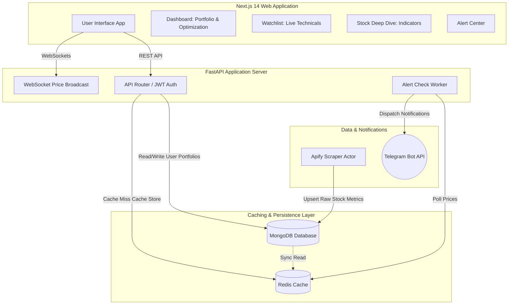

# StockSentinel — Personalised Stock Intelligence Agent

[](#tech-stack)
[](#telegram-alerts-configuration)
[](#license)

StockSentinel is a production-grade personal wealth-tracking intelligence agent. Built on top of an automated fundamental data scraper, it enriches raw market data with **14-day RSI** and **SMA-50** indicators, calculates **live portfolio Value-at-Risk (VaR 95%)**, simulates **macroeconomic stress scenarios**, forecasts **1-year Monte Carlo price paths**, and recommends holding reallocations (**Hold / Buy / Trim**) via a rules-based investment decision matrix.

## 1. System Architecture

StockSentinel is designed with a decoupled architecture where the scraping scheduler updates the shared database, the FastAPI backend processes user portfolios and alert checks, and the Next.js 14 frontend renders dynamic glassmorphic tracking widgets.




## 2. Key Modules & Features

### 📊 Portfolio Audit & Risk Metrics
* **Concentration Safety Thresholds:** Audits asset-to-portfolio weights and issues high concentration risk flags if a single stock exceeds $40\%$ allocation.
* **Capital Return Metrics:** Aggregates weighted P/E, weighted ROE/ROCE, and estimated annual dividend cash flows.
* **Value-at-Risk (VaR 95%):** Estimates maximum expected daily losses at a $95\%$ statistical confidence interval based on weighted position volatilities.

### 🎲 Sharpe Optimizer & Monte Carlo Forecaster
* **Interactive CAGR Slider:** Permits users to adjust expected annualized portfolio CAGR ($8\% - 25\%$) dynamically.
* **Live Sharpe Returns Efficiency:** Compares input return profiles with a $5.0\%$ risk-free baseline to calculate Sharpe ratios, outputting classification badges (`Excellent`, `Good`, `Sub-optimal`) and tailored optimization tips.
* **Geometric Brownian Motion Paths:** Projects 1-year wealth distributions at the 10th (Pessimistic), 50th (Median), and 90th (Optimistic) percentiles:
  $$S_t = S_0 \exp\left( (\mu - 0.5\sigma^2)t + \sigma \sqrt{t} Z \right)$$

### ⚡ Technical Indicator Screener
* **14-Day RSI Scanner:** Classifies stocks as `Oversold` ($\le 30$), `Overbought` ($\ge 70$), or `Neutral`.
* **50-Day SMA Breakouts:** Identifies bullish (Price > SMA-50) and bearish (Price < SMA-50) trends.
* **Interactive Filtering:** Isolates specific technical crossovers in the watchlist list and card grids.

### 🏛️ Rebalancing & Holding Action Matrix
Triggers asset rebalancing recommendations based on valuation (P/E), efficiency (ROE/ROCE), weight, and 52-week price boundaries:
1. **Trim / Sell:** Triggered if a position weight exceeds $30\%$ of the portfolio, or if P/E $>40$ while trading near its 52-week high ($>95\%$ percentile).
2. **Buy / Accumulate:** Triggered if P/E $<15$ with ROE/ROCE $>15\%$ (undervalued compounder), or if price falls near its 52-week low ($<10\%$ percentile) for a high-quality stock (ROE $>12\%$).
3. **Hold:** Standard recommendation for assets displaying fair valuation and optimal allocation.


## 3. Tech Stack

| Component | Technology | Description |
|---|---|---|
| **Frontend** | Next.js 14, React, Tailwind CSS, Recharts, Zustand | Glassmorphic interface with interactive controls & graphs |
| **Backend** | FastAPI, Uvicorn, Pydantic, PyJWT | High-speed REST endpoints + async tasks |
| **Database** | MongoDB Atlas | Persistent user accounts, alerts, and scraped stocks |
| **Caching** | Redis | 10-minute TTL cache for API requests and session tokens |
| **Notifications** | Telegram Bot API | Instant alerts dispatcher |
| **Scraper** | Python (BeautifulSoup) | Scheduled Apify Actor fetching fundamentals from Screener |

## 4. Environment Parameters

### Backend `.env`
Create a `.env` file inside `backend/` and configure:
```env
MONGODB_URI=mongodb+srv://<username>:<password>@cluster.mongodb.net/stocksentineldb
REDIS_URL=redis://localhost:6379
JWT_SECRET=your_long_secure_jwt_secret_key_here
JWT_EXPIRE_MINUTES=60
REFRESH_TOKEN_EXPIRE_DAYS=30
TELEGRAM_BOT_TOKEN=123456789:ABCdefGhIJKlmNoPQRsTUVwxyZ
FRONTEND_URL=http://localhost:3000
```

### Frontend `.env.local`
Create a `.env.local` file inside `frontend/` and configure:
```env
NEXT_PUBLIC_API_URL=http://localhost:8000
NEXT_PUBLIC_WS_URL=ws://localhost:8000
```


## 5. Local Setup & Docker Startup

### Running with Docker Compose (Recommended)
You can launch the complete database, cache, backend api, and frontend client with a single command:
```bash
docker compose up --build
```
* **Frontend:** [http://localhost:3000](http://localhost:3000)
* **Backend API Docs:** [http://localhost:8000/docs](http://localhost:8000/docs)
* **WebSockets Endpoint:** `ws://localhost:8000/ws/prices`

### Running Locally (Without Docker)

1. **Start Redis Server:**
   ```bash
   redis-server
   ```
2. **Start Backend API:**
   ```bash
   cd backend
   python -m venv venv
   source venv/bin/activate  # On Windows: .\venv\Scripts\activate
   pip install -r requirements.txt
   uvicorn app.main:app --reload
   ```
3. **Start Telegram Bot Worker:**
   ```bash
   cd backend
   source venv/bin/activate
   python -m app.services.telegram_bot
   ```
4. **Start Frontend Client:**
   ```bash
   cd frontend
   npm install
   npm run dev
   ```


## 6. Telegram Alerts Configuration

1. Search for your bot username on Telegram (created via [@BotFather](https://t.me/BotFather)).
2. In the StockSentinel Web UI, navigate to **Alerts → Link Telegram Bot** to fetch your activation command (e.g. `/start <auth_token>`).
3. Send this activation command to your bot on Telegram.
4. Your account is linked! The bot will now DM you live notifications for target price or stop-loss crossovers.


## 7. Deep Architecture & Schemas

For further details on implementation, schemas, and endpoints, read the dedicated documentation in the `docs/` directory:
* 📄 [Architecture Specification](./docs/ARCHITECTURE.md) — Alert checkers, stress simulators, Sharpe optimizers, and math models.
* 📄 [API Schema Reference](./docs/API_SPECIFICATION.md) — Comprehensive endpoints guide, parameters, and WebSocket frame structures.
* 📄 [Information Architecture](./docs/INFORMATION_ARCHITECTURE.md) — MongoDB schemas, collection indexes, Redis key/TTL structures, and frontend routing hierarchy.
