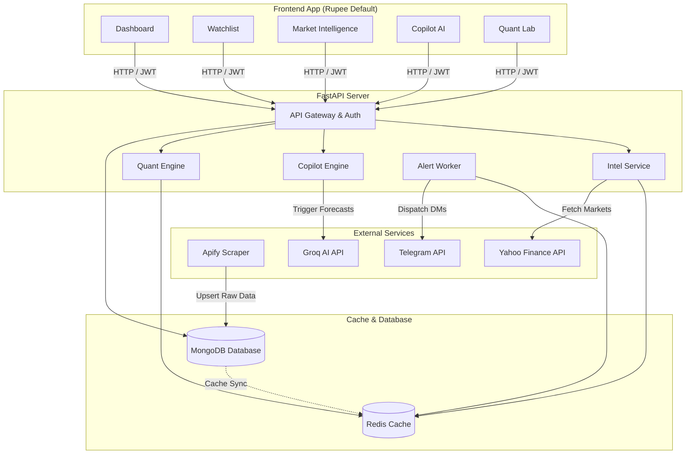
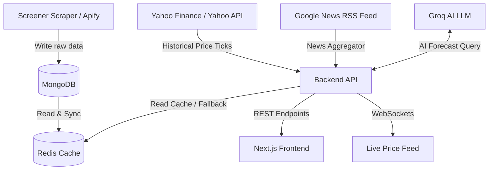

# StockSentinel — Institutional-Grade Stock Intelligence Agent

[](#technology-stack)
[](#core-feature-matrix)
[](#telegram-alerts-configuration)
[](#license)

StockSentinel is a production-grade personal wealth-tracking intelligence agent. Built on top of an automated fundamental data scraper, it integrates real-time equity analysis powered by **Groq AI (Llama 3.3)**, calculates **live portfolio Value-at-Risk (VaR 95%)**, conducts **technical RSI-14 / SMA-50 screeners**, and triggers **rebalancing recommendations** through a rules-based investment decision matrix.

All pricing outputs default to **Indian Rupees (₹)**. For global assets, the USD or native local currency price is displayed alongside as a reference.


## 1. System Architecture

StockSentinel is designed with a decoupled layout. The fundamental scraping pipeline updates the shared database, the FastAPI backend processes user requests and alert triggers, and the Next.js frontend renders an aesthetic, pitch-black glassmorphic trading terminal.




## 2. Core Feature Matrix

* **🔮 AI Forecast & Analysis (Groq Llama 3.3)**: Generates 1-year target prices, upside percentages, growth catalysts, and risk metrics using live financials and news sentiment.
* **📈 Bloomberg-Style Market Intelligence**: Real-time overview of global indices, commodities, forex, and cryptocurrency. Features economic/corporate calendars, insider block deals, and AI-driven news clustering.
* **📊 Portfolio Audit & Risk Metrics**: Audits asset-to-portfolio weights against a $40\%$ concentration safety threshold and estimates maximum expected daily losses using a **Value-at-Risk (VaR 95%)** model.
* **🎲 Sharpe Optimizer & Monte Carlo Forecaster**: Features an interactive CAGR target slider ($8\% - 25\%$) that compares returns against a $5.0\%$ risk-free rate, and simulates 1-year wealth distributions using **Geometric Brownian Motion**.
* **⚡ Technical Indicator Screener**: Evaluates the **14-day Relative Strength Index (RSI-14)** (Oversold $\le 30$, Overbought $\ge 70$) and detects bullish/bearish **50-day Simple Moving Average (SMA-50)** breakouts.
* **🏛️ Rebalancing & Holding Action Matrix**: Recommends holding shifts (**Trim / Buy / Hold**) based on valuation metrics (P/E), company efficiency (ROE/ROCE), portfolio weight, and 52-week price boundaries.
* **🔔 Live Telegram Price Alerts**: Dispatches instant Telegram direct messages for target price or stop-loss crossovers.


## 3. Data Pipelines & Flow



For a deep dive into data ingestion, scheduler intervals, Redis invalidation policies, and timezone-aware safety checks, read the [Data Flow & Pipelines Document](./docs/DATA_FLOW_PIPELINES.md).


## 4. Fundamental & Technical Valuation Logic

StockSentinel applies quantitative rules to evaluate equity positions:

### 4.1 Relative Strength Index (RSI-14)
$$\text{RSI} = 100 - \left( \frac{100}{1 + \text{RS}} \right)$$
Tracks momentum to flag overbought ($\ge 70$) or oversold ($\le 30$) zones.

### 4.2 Rebalancing Decisions Matrix
* **Trim / Sell:** Triggered if a position weight exceeds $30\%$ of the portfolio, or if P/E $>40$ while trading near its 52-week high ($>95\%$ percentile).
* **Buy / Accumulate:** Triggered if P/E $<15$ with ROE/ROCE $>15\%$ (undervalued compounder), or if price falls near its 52-week low ($<10\%$ percentile) for a high-quality stock (ROE $>12\%$).
* **Hold:** Standard recommendation for assets displaying fair valuation and optimal allocation.

For full formulas on capital efficiency, working capital debtor days, Value-at-Risk, and Sharpe optimization, read the [Trading Indicators & Valuations Document](./docs/TRADING_INDICATORS_VALUATIONS.md).


## 5. Technology Stack

| Component | Technology | Description |
|---|---|---|
| **Frontend** | Next.js 14, React, Tailwind CSS, Recharts, Zustand | Glassmorphic interface with interactive controls & graphs |
| **Backend** | FastAPI, Uvicorn, Pydantic, PyJWT | High-speed REST endpoints + async tasks |
| **Database** | MongoDB Atlas | Persistent user accounts, alerts, and scraped stocks |
| **Caching** | Redis | 10-minute TTL cache for API requests and session tokens |
| **Notifications** | Telegram Bot API | Instant alerts dispatcher |
| **Scraper** | Python (BeautifulSoup) | Scheduled Apify Actor fetching fundamentals from Screener |


## 6. Environment Parameters

### Backend `.env`
Create a `.env` file inside `backend/` and configure:
```env
MONGODB_URI=mongodb+srv://<username>:<password>@cluster.mongodb.net/stocksentineldb
REDIS_URL=redis://localhost:6379
JWT_SECRET=your_long_secure_jwt_secret_key_here
JWT_EXPIRE_MINUTES=60
REFRESH_TOKEN_EXPIRE_DAYS=30
TELEGRAM_BOT_TOKEN=123456789:ABCdefGhIJKlmNoPQRsTUVwxyZ
FRONTEND_URL=http://localhost:3000
GROQ_API_KEY=gsk_your_groq_api_key_goes_here
```

### Frontend `.env.local`
Create a `.env.local` file inside `frontend/` and configure:
```env
NEXT_PUBLIC_API_URL=http://localhost:8000
NEXT_PUBLIC_WS_URL=ws://localhost:8000
```


## 7. Setup & Startup

### Running with Docker Compose (Recommended)
You can launch the complete database, cache, backend api, and frontend client with a single command:
```bash
docker compose up --build
```
* **Frontend:** [http://localhost:3000](http://localhost:3000)
* **Backend API Docs:** [http://localhost:8000/docs](http://localhost:8000/docs)
* **WebSockets Endpoint:** `ws://localhost:8000/ws/prices`

### Running Locally (Without Docker)

1. **Start Redis Server:**
   ```bash
   redis-server
   ```
2. **Start Backend API:**
   ```bash
   cd backend
   python -m venv venv
   source venv/bin/activate  # On Windows: .\venv\Scripts\activate
   pip install -r requirements.txt
   uvicorn app.main:app --reload
   ```
3. **Start Telegram Bot Worker:**
   ```bash
   cd backend
   source venv/bin/activate
   python -m app.services.telegram_bot
   ```
4. **Start Frontend Client:**
   ```bash
   cd frontend
   npm install
   npm run dev
   ```


## 8. Telegram Alerts Configuration

1. Search for your bot username on Telegram (created via [@BotFather](https://t.me/BotFather)).
2. In the StockSentinel Web UI, navigate to **Alerts → Link Telegram Bot** to fetch your activation command (e.g. `/start <auth_token>`).
3. Send this activation command to your bot on Telegram.
4. Your account is linked! The bot will now DM you live notifications for target price or stop-loss crossovers.


## 9. Comprehensive Documentation Index

For further details on implementation, schemas, and endpoints, read the dedicated documentation in the `docs/` directory:
* 📄 [Architecture Specification](./docs/ARCHITECTURE.md) — System components, backend structures, and database keys.
* 📄 [API Schema Reference](./docs/API_SPECIFICATION.md) — REST endpoint specifications and WebSocket frame structures.
* 📄 [Information Architecture](./docs/INFORMATION_ARCHITECTURE.md) — Database collections, indexes, and routing paths.
* 📄 [Data Flow & Pipelines](./docs/DATA_FLOW_PIPELINES.md) — Scraping schedules, Redis cache strategies, and timezone validations.
* 📄 [Trading Indicators & Valuations](./docs/TRADING_INDICATORS_VALUATIONS.md) — Quantitative decision rules, VaR, and Sharpe metrics.
* 📄 [AI Agentic Forecasting](./docs/AI_AGENTIC_FORECASTING.md) — Groq Llama-3.3 prompt structures, caching, and fallback analysis.
* 📄 [Security & Authentication](./docs/SECURITY_AUTH_FLOW.md) — JWT lifecycle, cookies, and client layout route guards.
