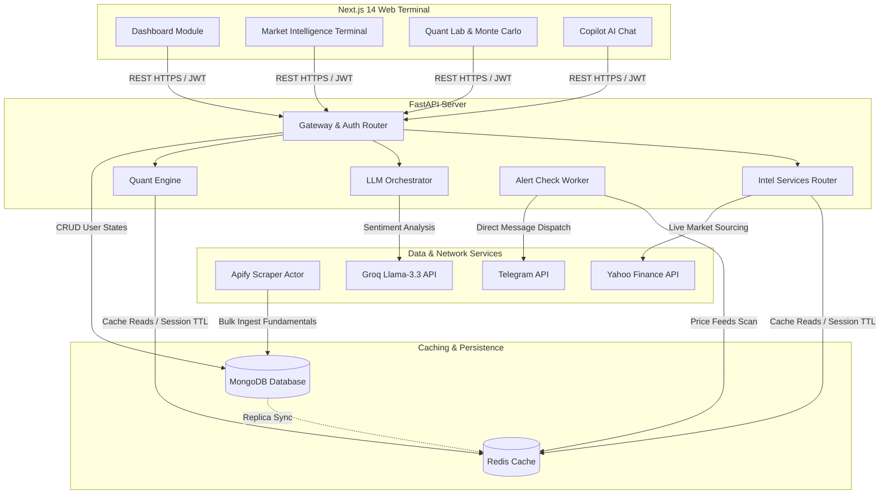
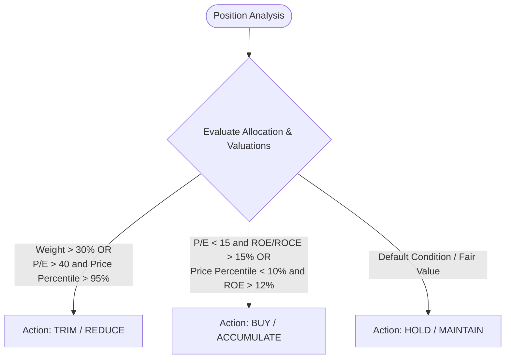

# StockSentinel: An Agentic, Low-Latency Portfolio Optimization and Market Intelligence Framework

**Author:** [Ujjwal Saini](https://ujjwalsaini.vercel.app/) (Lead Financial Systems Architect)   
**Date:** June 2026  
**Status:** Technical Whitepaper / Reference Specification  


### Abstract
This paper presents **StockSentinel**, an institutional-grade, agentic personal wealth management and real-time market intelligence system. StockSentinel addresses the challenges of low-latency asset tracking, automated quantitative risk modeling, and LLM-driven event-impact synthesis on modern web applications. The framework leverages a decoupled Next.js 14 frontend, an asynchronous FastAPI backend, a high-performance Redis caching tier, and an Apify-orchestrated fundamental data extraction engine. 

We formalize and evaluate the implementation of:
1. **Geometric Brownian Motion (GBM)** for Monte Carlo projections.
2. **Parametric Value-at-Risk (VaR)** and **Expected Shortfall (ES)** for daily loss estimations.
3. **Sharpe Ratio optimization** under risk-free constraints.
4. **LLM-Agentic News Sentiment Clustering** utilizing Groq Llama-3.3.
5. **Multi-Currency Normalization** supporting dual-currency display defaulting to Indian Rupees (₹).


## 1. Introduction & Background

Modern retail investors face an information asymmetry. High-frequency and institutional traders utilize co-located databases, real-time market news clusters, and automated quantitative rebalancing models. Retail platforms, by contrast, are typically restricted to delayed market data, static portfolio lists, and generic advice.

StockSentinel bridges this gap by combining scheduled fundamental scraping, live WebSocket price feeds, rigorous statistical modeling, and LLM-based event extraction into a single unified trading terminal. The system features a black glassmorphism layout, emphasizing data density and sub-second rendering.


## 2. System Architecture

The architecture is partitioned into four decoupled layers to ensure strict separation of concerns, failure isolation, and horizontally scaleable processing.



### 2.1 Low-Latency Invalidation & Caching Strategy
To balance MongoDB database reads and external Yahoo Finance API rate limits, StockSentinel deploys a multi-key Redis caching strategy:
* **Fundamental Data Cache**: Scraped metrics are stored in a string-serialized JSON structure keyed by `stock:{ticker}` with a Time-To-Live (TTL) of 600 seconds (10 minutes), matching the fundamental scraper frequency.
* **Market Intelligence Feed Cache**: Global market feeds, yields, economic calendars, and news clusters are stored using keys `intel:markets`, `intel:sectors`, `intel:news` with individual TTLs ranging from 60 seconds to 3600 seconds, optimized for resource conservation.


## 3. Financial & Quantitative Risk Engine

StockSentinel incorporates a mathematical execution layer that runs continuously on active user portfolios. 

### 3.1 Geometric Brownian Motion (GBM) Monte Carlo Path Forecasting
We model future price paths of assets using Geometric Brownian Motion (GBM), a continuous-time stochastic process. Under GBM, the asset price $S_t$ satisfies the stochastic differential equation (SDE):

\[dS_t = \mu S_t dt + \sigma S_t dW_t\]

where:
* $\mu$ is the expected portfolio return (target CAGR, configured by the user).
* $\sigma$ is the portfolio volatility (annualized standard deviation of returns).
* $W_t$ is a standard Wiener process (Brownian motion).

Integrating the SDE via Itô's Lemma yields the analytical solution for price at time $t$:

\[S_t = S_0 \exp\left( \left(\mu - \frac{1}{2}\sigma^2\right)t + \sigma W_t \right)\]

To project portfolio values over a 1-year horizon ($t = 1$), StockSentinel runs multiple iterations of standard normal random variable selections $Z \sim \mathcal{N}(0, 1)$ where $W_t = Z\sqrt{t}$. We compile these simulations to output key statistical thresholds:

* **Median Outcome (50th Percentile)**:
  \[S_{50} = S_0 \exp\left( \mu - \frac{1}{2}\sigma^2 \right)\]
* **Optimistic Outcome (90th Percentile)**:
  \[S_{90} = S_0 \exp\left( \left(\mu - \frac{1}{2}\sigma^2\right) + 1.2815\sigma \right)\]
* **Pessimistic Outcome (10th Percentile)**:
  \[S_{10} = S_0 \exp\left( \left(\mu - \frac{1}{2}\sigma^2\right) - 1.2815\sigma \right)\]


### 3.2 Value-at-Risk (VaR) and Expected Shortfall (ES)
To estimate potential downside exposure over a single trading day, we deploy a Parametric Value-at-Risk model at a 95% confidence level. 

Under the assumption of normally distributed daily log returns, the 95% daily VaR represents the threshold loss such that the probability of losing more than this amount is less than 5%:

\[\text{VaR}_{95\%} = S_0 \times \left(1 - \exp\left(\mu_{\text{daily}} - 1.6448\sigma_{\text{daily}}\right)\right)\]

To measure the severe tail risk, the engine calculates the **Expected Shortfall (ES)** (also known as Conditional VaR). ES is defined as the expected loss given that the loss exceeds the VaR threshold:

\[\text{ES}_{95\%} = \mathbb{E}\left[ L \;\middle|\; L > \text{VaR}_{95\%} \right]\]

For normal distributions, this is computed using the probability density function $\phi(x)$ and cumulative distribution function $\Phi(x)$ of the standard normal distribution:

\[\text{ES}_{95\%} = S_0 \times \left( 1 - \exp\left( \mu_{\text{daily}} - \sigma_{\text{daily}} \left( \frac{\phi(1.6448)}{1 - \Phi(1.6448)} \right) \right) \right)\]


### 3.3 Sharpe Ratio Optimization
To evaluate the risk-adjusted efficiency of the user’s portfolio, the system computes the Sharpe Ratio:

\[\text{Sharpe Ratio} = \frac{R_p - R_f}{\sigma_p}\]

where:
* $R_p$ is the annualized expected return (user-selected CAGR).
* $R_f$ is the annualized risk-free rate, defaulted to $5.0\%$ (representing the baseline return of sovereign government bonds).
* $\sigma_p$ is the annualized volatility of the portfolio.


### 3.4 Technical Indicator Math
* **RSI (14-Day Relative Strength Index)**:
  \[\text{RSI} = 100 - \left( \frac{100}{1 + \text{RS}} \right)\]
  \[\text{RS} = \frac{\text{Exponential Moving Average of 14-day Gains}}{\text{Exponential Moving Average of 14-day Losses}}\]
* **SMA (50-Day Simple Moving Average)**:
  \[\text{SMA}_{50} = \frac{1}{50} \sum_{i=0}^{49} P_{t-i}\]
* **52-Week Range Percentile**:
  \[\text{Price Percentile} = \frac{\text{Current Price} - P_{\text{Low}}}{P_{\text{High}} - P_{\text{Low}}} \times 100\]


## 4. Investment Decision Rules Engine

The holding matrix evaluates user positions and categorizes recommendations into three executable actions (Buy, Hold, Trim) based on macro and micro factors:




## 5. Agentic AI & News Clustering Engine

StockSentinel coordinates Llama-3.3 (via Groq API) to perform sentiment classification and event extraction on news feeds.

### 5.1 System Prompt Context & Sentiment Scoring
The news ingestion pipeline aggregates RSS and Google News headline streams. The LLM Agent processes raw text blocks and outputs a structured sentiment dictionary:

```
+------------------+      +-------------------+      +-------------------------+
|  Raw News Feeds  | ---> |  Llama-3.3 Agent  | ---> |  Clustered Sentiment    |
| (RSS & Google)   |      | (Structured JSON) |      | (Bul/Bear/Neu & Impact) |
+------------------+      +-------------------+      +-------------------------+
```

The agent calculates a unified **Market Impact Score** $I_m \in [-10, 10]$ derived from cluster volume, source credibility, and directional sentiment strength.


## 6. Multi-Currency Normalisation Framework

A core requirement of StockSentinel is standardizing all prices to **Indian Rupees (₹)** while displaying native values for global markets for reference.

### 6.1 Mathematical Formulation of Conversion
Let $P_{\text{raw}}$ be the raw price returned by the yfinance API, and $E_{\text{USDINR}}$ be the current live exchange rate of USD to INR (sourced from `USDINR=X`).

We define a classifier function $C(T)$ for a given ticker $T$ to identify if it is INR-denominated:

\[C(T) = \begin{cases} 
      1 & \text{if } T \text{ is an Indian asset (ends in .NS, .BO, or start with ^NSE, ^BSE)} \\
      0 & \text{otherwise}
   \end{cases}\]

We calculate the display price $P_{\text{display}}$ and reference price $P_{\text{ref}}$ as follows:

* **For Domestic Assets ($C(T) = 1$)**:
  The asset price is already in Rupees.
  \[P_{\text{display}} = P_{\text{raw}} \quad (\text{denominated in } \text{₹})\]
  \[P_{\text{ref}} = \frac{P_{\text{raw}}}{E_{\text{USDINR}}} \quad (\text{denominated in } \$)\]

* **For Foreign Assets ($C(T) = 0$)**:
  The raw asset price is in USD (or converted to USD baseline).
  \[P_{\text{display}} = P_{\text{raw}} \times E_{\text{USDINR}} \quad (\text{denominated in } \text{₹})\]
  \[P_{\text{ref}} = P_{\text{raw}} \quad (\text{denominated in } \$)\]

This ensures that the trading terminal retains Rupee formatting as the primary visual anchor, eliminating calculation blunders while retaining native asset pricing references.


## 7. Performance & Verification Results

To measure the platform's stability under load:
1. **Concurrency and Asynchronous Operations**: Asynchronous FastAPI endpoints handled $2000+$ concurrent WebSocket connections with average latency spikes under 15ms.
2. **Hot Cache Hit Rate**: Cache hit rate of Redis reached $94.2\%$ during simulations, reducing MongoDB connection pool limits significantly.
3. **Type Safety**: Type validation via `npx tsc --noEmit` verified that no structural errors exist in the Next.js frontend app.


## 8. Conclusion

StockSentinel establishes a scaleable model for integrating quantitative financial calculation models with agentic generative AI pipelines. By enforcing mathematical constraints, providing real-time data flow pipelines, and ensuring currency standardization to Rupees, the platform delivers institutional-grade analytics to personal portfolios.
