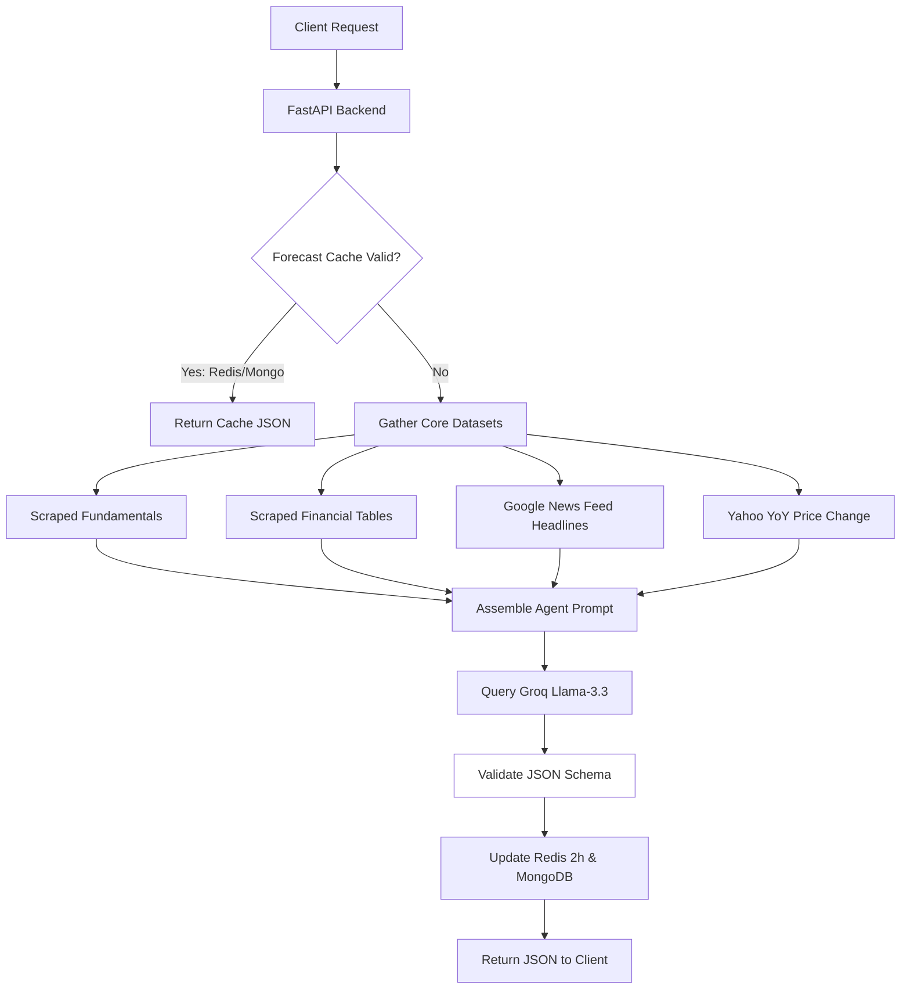

# AI Agentic Forecasting

This document outlines the architecture, LLM agent workflows, cache controls, and fallback engines powering the Groq AI Stock Forecasting and Analytics module.

## 1. AI Integration Architecture

StockSentinel incorporates an AI analyst agent that evaluates news headlines, raw fundamentals, and trailing financials to produce equity projections.




## 2. LLM Engine Specifications

* **Provider & Model:** **Groq Cloud API** running `llama-3.3-70b-versatile`.
* **Inference Modes:** Configured for `json_object` format to ensure programmatic compatibility with the React/TypeScript charts and tables.
* **System Prompt Core Context:**
  - Operates as a conservative, data-driven equity analyst.
  - Required to output strict JSON matching the defined schema.
  - Warned to discount generic PR headlines and analyze warnings (e.g. ASM listings, high debtor days, or high valuations).


## 3. Data Gathering & Prompt Assembly

The backend collects multiple data points before querying the LLM:
1. **Fundamental Overview:** Current valuation, P/E ratio, ROCE, and ROE.
2. **Growth Trend Tables:** Quarterly sales figures, annual sales over 5 years, and promoter holding shifts.
3. **News Sentiment Check:** Fetches the latest 5 Google News RSS headlines linked to the stock ticker.
4. **Price Metric Computations:** Trailing 52-week pricing boundaries and YoY performance calculations.


## 4. Structured Output Schema

The LLM is prompted to structure its analysis as a JSON object matching this schema:

```json
{
  "rating": "Buy | Hold | Sell",
  "rating_rationale": "Detailed explanation of the rating.",
  "price_target_1y": 1234.56,
  "upside_percent": 15.4,
  "outlook_summary": "1-year business prospect analysis.",
  "catalysts": [
    {
      "factor": "Rolls-Royce contracts",
      "status": "Confirmed | Pending | Strong",
      "timeframe": "Jun 2026",
      "description": "7-year export order."
    }
  ],
  "risks": [
    {
      "factor": "Debtor Days increase",
      "severity": "Caution | High | Moderate",
      "description": "Cash conversion concerns."
    }
  ]
}
```


## 5. Layered Caching & Timezone Safety

To balance low latency and API cost management, the backend implements a layered caching system:

1. **Redis Cache (Hot Cache):**
   - Stores the generated JSON analysis under `stock:forecast:{ticker}`.
   - Cache TTL: **2 hours** (7200 seconds).
2. **MongoDB Storage (Cold Backup):**
   - Keeps a copy in the `stocks` collection under `ai_forecast` for persistent fallback tracking.
3. **Timezone-Aware Freshness Invalidation:**
   - Both cache layers check age comparisons using timezone-aware UTC dates:
   ```python
   # Timezone-aware check
   if forecast_doc and (datetime.now(timezone.utc) - forecast_doc['last_updated'].replace(tzinfo=timezone.utc)).total_seconds() < 7200:
       return forecast_doc['data']
   ```
   This prevents crashes and ensures data is refreshed every 2 hours.


## 6. Programmatic Fallback Analyzer Engine

If the user's Groq API key is not configured or the service is temporarily unavailable, the system runs a programmatic analysis fallback:
* **Target Pricing Calculations:** Evaluates historical averages, ROCE/ROE scores, and industry benchmarks to estimate a 12-month target price.
* **Risk & Catalyst Scanners:** Scans warnings and financials programmatically to generate structured tables (e.g. flags high debtor days as a `Caution` cash risk, or warns if the P/E exceeds 35x).
* **Rating Deciders:** Leverages the rebalancing recommendations engine to output a matching programmatic `Buy`, `Hold`, or `Sell` rating.
* **Output Format:** Generates the exact same JSON schema structure so that the frontend charts, progress indicators, and UI components continue rendering seamlessly.
