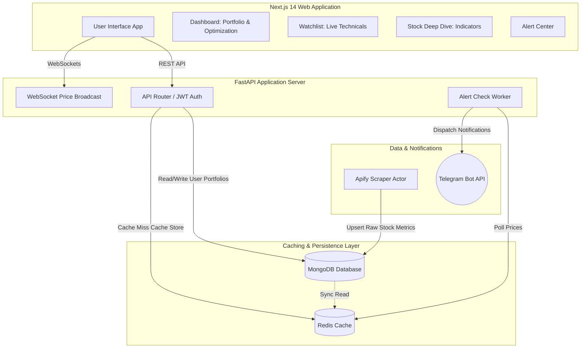
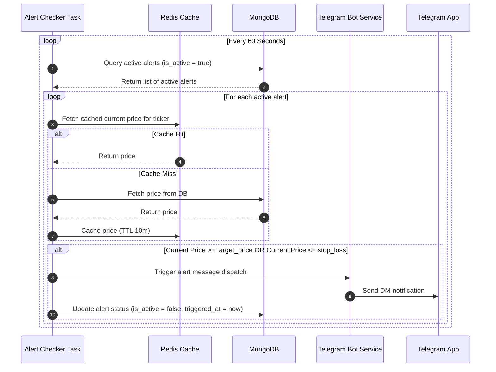

# StockSentinel — Personalised Stock Intelligence Agent
## Complete Platform Architecture & Build Guide


## 1. What Your Scraper Does (Analysed)

Your existing `StockScrapper.py` (Apify actor):
- Fetches fundamentals from **screener.in**: Market Cap, Current Price, High/Low, P/E, Dividend Yield, ROCE, ROE, Face Value
- Fetches **Previous Close** from Google Finance
- Writes to MongoDB (`stocksentineldb.Stocks`) with upsert per ticker
- Runs on schedule: **Mon–Fri, 9:30 AM – 3:30 PM, every 10 min**

**What we build on top of it:**
- User auth (JWT) so every user tracks their own portfolio
- Per-user ticker watchlist stored in MongoDB
- Redis caching for stock data (TTL = 10 min aligned to your scraper)
- Telegram bot with price-level alerts (buy/sell triggers)
- Next.js 14 frontend: personalised dashboard per user


## 2. Full Stack Overview




## 3. MongoDB Schema

### Collection: `users`
```json
{
  "_id": "ObjectId",
  "email": "string (unique)",
  "password_hash": "string (bcrypt)",
  "name": "string",
  "telegram_chat_id": "string | null",
  "created_at": "datetime",
  "portfolio": [
    {
      "ticker": "RELIANCE",
      "exchange": "NSE",
      "buy_price": 2400.0,
      "quantity": 10,
      "buy_date": "2024-01-15",
      "notes": "Long term hold"
    }
  ]
}
```

### Collection: `stocks` (written by your scraper)
```json
{
  "_id": "ObjectId",
  "ticker": "RELIANCE",
  "exchange": "NSE",
  "current_price": 2450.0,
  "previous_close": 2430.0,
  "market_cap": 1658000.0,
  "high": 2470.0,
  "low": 2410.0,
  "stock_pe": 28.4,
  "dividend_yield": 0.36,
  "roce": 10.8,
  "roe": 9.1,
  "face_value": 10.0,
  "last_updated": "datetime"
}
```

### Collection: `alerts`
```json
{
  "_id": "ObjectId",
  "user_id": "ObjectId (ref: users)",
  "ticker": "TMCV",
  "exchange": "NSE",
  "buy_price": 410.0,
  "target_price": 415.0,
  "stop_loss": 400.0,
  "alert_type": "above | below | both",
  "is_active": true,
  "triggered_at": "datetime | null",
  "created_at": "datetime",
  "note": "string"
}
```

### Collection: `price_history`
```json
{
  "_id": "ObjectId",
  "ticker": "RELIANCE",
  "price": 2450.0,
  "timestamp": "datetime"
}
```


## 4. Backend: FastAPI

### File Structure
```
backend/
├── app/
│   ├── main.py              # FastAPI app, CORS, startup
│   ├── config.py            # Env vars (Pydantic Settings)
│   ├── database.py          # MongoDB + Redis clients
│   ├── models/
│   │   ├── user.py          # Pydantic models
│   │   ├── stock.py
│   │   └── alert.py
│   ├── routers/
│   │   ├── auth.py          # /auth/register, /auth/login, /auth/refresh
│   │   ├── portfolio.py     # /user/portfolio CRUD
│   │   ├── stock.py         # /stock/{ticker}, /stock/search
│   │   ├── alerts.py        # /alerts CRUD + trigger check
│   │   └── websocket.py     # /ws/prices
│   ├── services/
│   │   ├── auth_service.py  # JWT logic
│   │   ├── stock_service.py # Redis cache logic
│   │   ├── alert_service.py # Alert checking
│   │   └── telegram.py      # Bot notifications
│   └── tasks/
│       └── alert_checker.py # Background task: poll prices → fire alerts
├── .env
└── requirements.txt
```

### Key Endpoints
| Method | Path | Description |
|--------|------|-------------|
| POST | /auth/register | Create account |
| POST | /auth/login | Get JWT tokens |
| POST | /auth/refresh | Refresh access token |
| GET | /user/me | Profile + portfolio |
| POST | /user/portfolio | Add stock to portfolio |
| DELETE | /user/portfolio/{ticker} | Remove from portfolio |
| GET | /stock/{ticker} | Get stock data (Redis → Mongo) |
| GET | /stock/search?q=REL | Fuzzy search tickers |
| POST | /alerts | Create alert |
| GET | /alerts | List my alerts |
| DELETE | /alerts/{id} | Remove alert |
| POST | /user/telegram | Link Telegram chat_id |
| GET | /ws/prices | WebSocket live prices |

## 5. Redis Caching Strategy

```python
# Cache key pattern: stock:{ticker}
# TTL: 600 seconds (10 min = scraper interval)

async def get_stock(ticker: str):
    cached = await redis.get(f"stock:{ticker}")
    if cached:
        return json.loads(cached)
    
    # Miss → fetch from MongoDB
    stock = await db.stocks.find_one({"ticker": ticker})
    if stock:
        await redis.setex(f"stock:{ticker}", 600, json.dumps(stock))
    return stock
```


## 6. Alert System

### Alert Checker (Background Task — runs every 60s)



```python
async def check_alerts():
    active_alerts = await db.alerts.find({"is_active": True}).to_list()
    for alert in active_alerts:
        stock = await get_stock(alert["ticker"])
        price = stock["current_price"]
        
        triggered = False
        message = ""
        
        if alert["target_price"] and price >= alert["target_price"]:
            triggered = True
            message = f"🎯 {alert['ticker']} hit your TARGET ₹{alert['target_price']}! Current: ₹{price}"
        
        elif alert["stop_loss"] and price <= alert["stop_loss"]:
            triggered = True  
            message = f"🔴 {alert['ticker']} hit STOP LOSS ₹{alert['stop_loss']}! Current: ₹{price}"
        
        if triggered:
            await send_telegram(alert["user_id"], message)
            await db.alerts.update_one(
                {"_id": alert["_id"]},
                {"$set": {"is_active": False, "triggered_at": datetime.utcnow()}}
            )
```


## 7. Telegram Bot

### Setup
1. Create bot via @BotFather → get `BOT_TOKEN`
2. User links their account via `/start` command → bot captures `chat_id`
3. Backend stores `telegram_chat_id` on user document

### Bot Commands
- `/start` — Link to StockSentinel account (sends deep link)
- `/portfolio` — Quick portfolio summary
- `/price RELIANCE` — Instant price check
- `/alerts` — List active alerts

### Linking Flow
```
User visits StockSentinel Settings → clicks "Link Telegram"
→ Opens t.me/YourBot?start=USER_JWT_TOKEN
→ Bot receives /start with token
→ Bot sends chat_id to /user/telegram endpoint
→ Account linked ✓
```

## 8. Next.js 14 Frontend

### Routes
```
app/
├── (auth)/
│   ├── login/page.tsx
│   └── register/page.tsx
├── (dashboard)/
│   ├── layout.tsx          # Sidebar + auth guard
│   ├── dashboard/page.tsx  # Overview: portfolio value, P&L
│   ├── watchlist/page.tsx  # All tracked tickers
│   ├── stock/[ticker]/
│   │   └── page.tsx        # Deep stock view
│   └── alerts/page.tsx     # Alert management
├── api/                    # Next.js API routes (proxy to FastAPI)
└── layout.tsx
```

### Key Features Per Page

**Dashboard:**
- Total portfolio value + daily P&L
- Top gainers/losers in portfolio
- Market status indicator (open/closed)
- Recent alert triggers

**Watchlist:**
- Add any NSE ticker
- Live price cards (WebSocket)
- Quick-add alert button per stock

**Stock Detail `/stock/RELIANCE`:**
- Price chart (Recharts)
- All screener.in fundamentals
- Your holding details (avg buy price, qty, total value, P&L)
- Set alert panel
- Price history graph

**Alerts Page:**
- Create alert: ticker + target + stop-loss
- Active alerts list
- Triggered history


## 9. Environment Variables

### Backend `.env`
```env
MONGODB_URI=mongodb+srv://...
REDIS_URL=redis://localhost:6379
JWT_SECRET=your_super_secret_key_here
JWT_EXPIRE_MINUTES=60
REFRESH_TOKEN_EXPIRE_DAYS=30
TELEGRAM_BOT_TOKEN=your_bot_token_here
FRONTEND_URL=http://localhost:3000
```

### Frontend `.env.local`
```env
NEXT_PUBLIC_API_URL=http://localhost:8000
NEXT_PUBLIC_WS_URL=ws://localhost:8000
```


## 10. Deployment

### Quick Start (Docker Compose)
```yaml
version: "3.9"
services:
  backend:
    build: ./backend
    ports: ["8000:8000"]
    env_file: ./backend/.env
    
  frontend:
    build: ./frontend
    ports: ["3000:3000"]
    env_file: ./frontend/.env.local
    
  redis:
    image: redis:7-alpine
    ports: ["6379:6379"]
    
  telegram-bot:
    build: ./backend
    command: python -m app.services.telegram_bot
    env_file: ./backend/.env
```

### Production
- Frontend → **Vercel** (Next.js native)
- Backend → **Railway / Render** (FastAPI)
- MongoDB → **MongoDB Atlas** (already using)
- Redis → **Upstash** (serverless Redis, free tier)
- Telegram Bot → same backend (webhook mode for production)


## 11. Build Order

1. ✅ **Backend auth** — register/login/JWT
2. ✅ **Stock endpoint** — Redis → MongoDB pipeline  
3. ✅ **Portfolio CRUD** — add/remove holdings
4. ✅ **Alert CRUD** — create/list/delete
5. ✅ **Alert checker** — background task
6. ✅ **Telegram bot** — link + notify
7. ✅ **Next.js auth pages** — login/register
8. ✅ **Dashboard** — portfolio overview
9. ✅ **Stock detail page** — full data view
10. ✅ **Alerts UI** — manage alerts
11. ✅ **WebSocket** — live price updates


## 12. Technical Indicators & Alert Scheduler

### Technical Indicators
The platform enriches base stock entries with technical signals:
* **RSI (Relative Strength Index):** Computed over 14-day intervals to signal overbought (>70) or oversold (<30) conditions.
* **SMA (Simple Moving Average):** A 50-day average price baseline to identify bullish/bearish trend breakouts.
* **52-Week Range Percentile:** Traces position relative to high/low margins:
  $$\text{Price Percentile} = \frac{\text{Current Price} - \text{Low}}{\text{High} - \text{Low}} \times 100$$

### Alert Scheduler
A periodic background worker runs in the FastAPI application:
1. Every **60 seconds**, checks all active alerts in MongoDB.
2. Compares alert target and stop-loss parameters with cached Redis price points.
3. If breached, sends an instant Telegram notification via the linked Telegram Bot token and turns the alert inactive.

## 13. Monte Carlo Path Forecaster & Sharpe Optimization

### Sharpe Ratio Optimizer
Calculates real-time risk-efficiency based on user expected CAGR (8%–25%) and portfolio volatility:
$$\text{Sharpe Ratio} = \frac{\text{Expected CAGR} - \text{Risk Free Rate (5.0\%)}}{\text{Portfolio Volatility}}$$

Ratings:
* **Excellent ($\ge 1.0$):** High return relative to variance.
* **Good ($\ge 0.5$ and $< 1.0$):** Balanced efficiency.
* **Sub-optimal ($< 0.5$):** Rebalancing suggested.

### 1-Year Monte Carlo Projections
Simulates portfolio outcomes analytically using Geometric Brownian Motion:
* **Optimistic Path (90th Percentile):**
  $$S_{90} = S_0 \exp\left( (\mu - 0.5\sigma^2) + 1.2815\sigma \right)$$
* **Median Path (50th Percentile):**
  $$S_{50} = S_0 \exp\left( \mu - 0.5\sigma^2 \right)$$
* **Pessimistic Path (10th Percentile):**
  $$S_{10} = S_0 \exp\left( (\mu - 0.5\sigma^2) - 1.2815\sigma \right)$$
*(where $S_0$ = portfolio value, $\mu$ = expected CAGR, $\sigma$ = portfolio volatility)*


## 14. Holding-by-Holding Decision Matrix

A rules-engine generates action recommendations (Hold / Buy / Trim) for every ticker:
1. **Trim:** If weight $>30\%$ (concentration risk), or if P/E $>40$ with price percentile $>95\%$ (overvalued near peak).
2. **Buy:** If P/E $<15$ with ROE/ROCE $>15\%$ (undervalued high-efficiency compounder), or if price percentile $<10\%$ with ROE/ROCE $>12\%$ (quality stock near bottom).
3. **Hold:** Stable valuation and optimal position weight.


## 15. Advanced Agent Features (Phase 2)

Once core is live, extend with:
* **AI Summary per stock** — call LLM to generate "why this stock moved today" using the scraped news and data.
* **Smart alerts** — "Alert me if ROCE drops below 15%", not just price thresholds.
* **Weekly digest** — Telegram bot sends Sunday portfolio summary and performance metrics.
* **Multi-exchange** — extend scraper to BSE tickers.
* **Paper trading mode** — simulate trades without real money.
