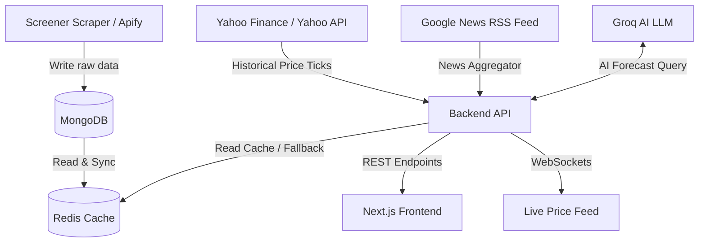
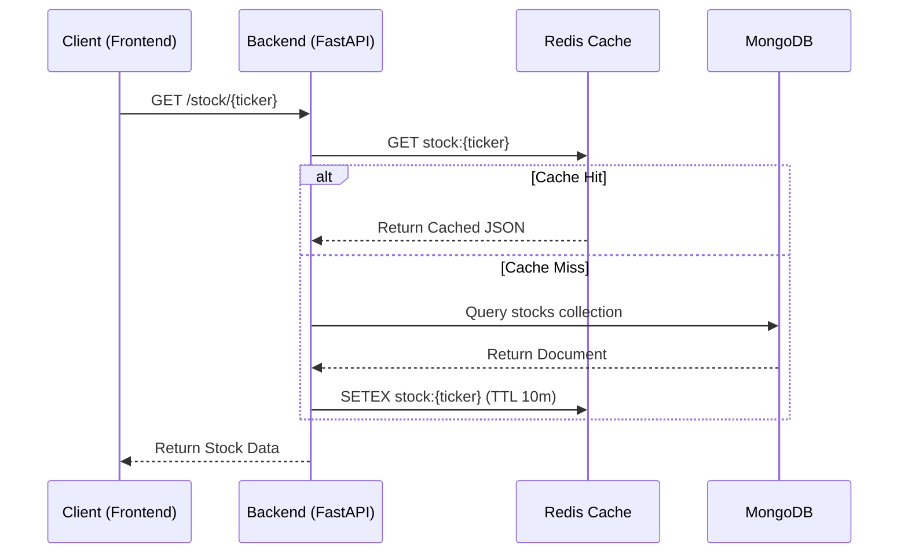
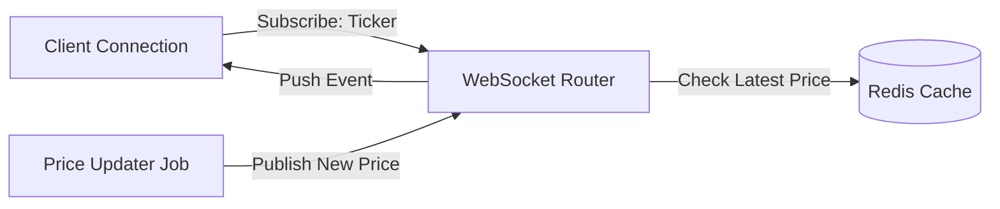

# Data Flow & Pipelines

This document details the data lifecycle, collection pipelines, cache orchestration, and real-time streaming components of the StockSentinel platform.


## 1. Data Flow Overview

StockSentinel employs a multi-tiered data pipeline that moves raw fundamentals and market sentiment metrics into user dashboards.




## 2. Ingestion Pipelines

### 2.1 Screener.in Fundamentals Scraper
The fundamental scraping pipeline is executed as an Apify actor utilizing Python (`BeautifulSoup`):
* **Execution Schedule:** Monday through Friday, 9:30 AM – 3:30 PM (IST), triggering every 10 minutes.
* **Extracted Data Points:**
  - Standard fundamentals (Market Cap, current price, 52-week boundaries, Price-to-Earnings, Dividend Yield, ROCE, ROE, Face Value).
  - Extended financial tables:
    - **Quarterly Sales & Expenses** (over the last 4 quarters).
    - **Annual Profit & Loss Statements** (over the last 5 financial years).
    - **Shareholding Patterns** (Promoters, FIIs, DIIs, Public percentages).
  - Risk factors: Special flags such as **Additional Surveillance Measure (ASM)** listing, **Quality Risk** (other income inflating profits), and **Cash Concerns** (long debtor days).

### 2.2 Historical Price Tick Pipelines (Yahoo Finance)
When a user visits a stock's analysis page:
* The backend invokes `scraper_service.py` to extract historical daily close prices from Yahoo Finance over a 12-month trailing period.
* This dataset is used to calculate the stock's Year-over-Year (YoY) performance and construct trend charts.

## 3. Caching & Invalidation Logic

To prevent rate-limiting from external APIs and reduce read pressure on MongoDB, the system features a layered caching strategy utilizing Redis and local MongoDB storage.



### 3.1 Redis Caching Details
* **Stock Fundamentals (`stock:{ticker}`)**:
  - Cache TTL: **10 minutes** (600 seconds), aligned with the fundamental scraper execution schedule.
* **User Active Alerts (`alerts:user:{user_id}`)**:
  - Cache TTL: **5 minutes** (300 seconds), storing active price trigger levels to optimize the alert monitoring worker's execution frequency.
* **WebSocket Streams (`websocket:price:{ticker}`)**:
  - Stores the latest broadcast tick without a TTL to ensure new WebSocket connections immediately receive a baseline price.


## 4. Timezone Safety Validations

When syncing external API requests, checking cache freshness, or validating stock alerts, all dates and times are standardized to prevent datetime matching errors.

### 4.1 Timezone-Aware Operations
All timestamps are calculated using UTC to prevent issues where offset-naive dates (lacking timezone data) are compared with offset-aware datetimes (which contain timezone info). 

```python
# Safe, timezone-aware UTC datetime generation
from datetime import datetime, timezone

# Correct way to evaluate timestamps:
current_utc_time = datetime.now(timezone.utc)
time_difference = current_utc_time - last_updated_time
```

This prevents `TypeError: can't subtract offset-naive and offset-aware datetimes` crashes during system checks.


## 5. Live Price Streaming (WebSockets)

For real-time updates without heavy polling, StockSentinel exposes a WebSocket gateway (`/ws/prices`):



* **Gateway Route:** `GET /ws/prices`
* **Protocol Flow:**
  1. The client establishes a persistent connection.
  2. The client sends a subscription payload (e.g., `{"action": "subscribe", "tickers": ["SIGMAADV", "RVNL"]}`).
  3. The WebSocket controller registers the client to the ticker channel groups.
  4. The background alert worker or scrapers publish updated prices to the channels, which are immediately pushed to subscribed clients.
