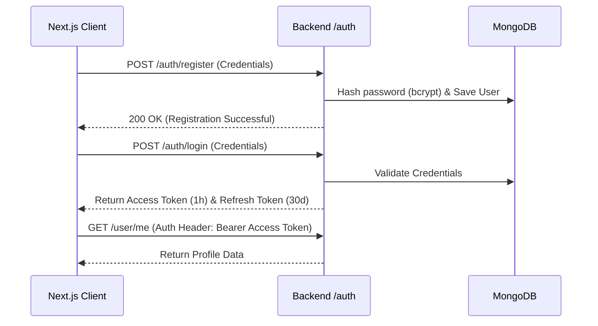
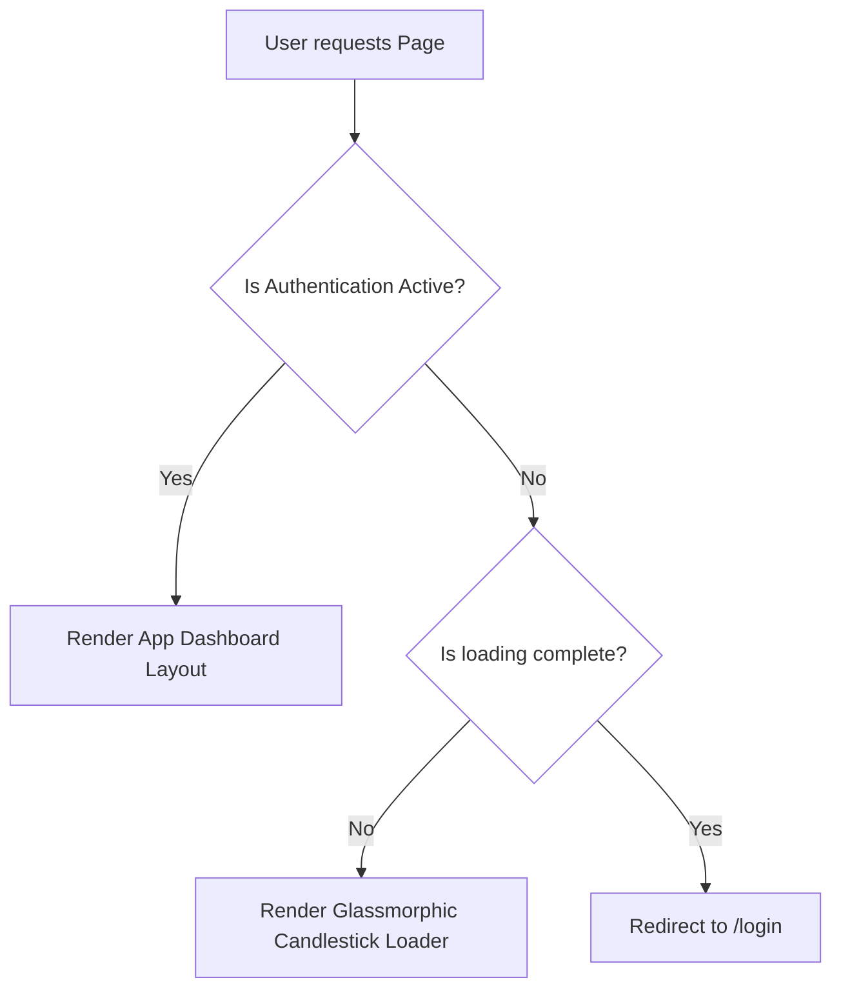

# Security & Authentication Flow

This document details the authentication protocols, token management cycles, and route protection mechanisms implemented across the StockSentinel platform.


## 1. Authentication Architecture

StockSentinel utilizes JSON Web Token (JWT) credentials to authenticate requests between the Next.js frontend client and the FastAPI backend server.




## 2. Token Lifecycle & Expiry Policies

To maintain security while providing a seamless user experience, a dual-token strategy is employed:

| Token Type | Purpose | Expiry Duration | Storage / Delivery |
|---|---|---|---|
| **Access Token** | Authorizes API requests to protected endpoints. | **60 Minutes** | Sent in REST Headers: `Authorization: Bearer <token>` |
| **Refresh Token** | Requests a new Access Token when expired. | **30 Days** | Stored in Local Storage or Cookie configurations |

### 2.1 Refresh Token Rotation Flow
When the frontend API client receives a `401 Unauthorized` response due to an expired access token:
1. The API client intercepts the error.
2. It pauses pending requests and sends a POST request to `/auth/refresh` containing the stored `refresh_token`.
3. If valid, the backend returns a new access token and a refreshed rotation token.
4. The client updates local storage/cookies and retries the original request.
5. If the refresh token is also expired or invalid, the client clears the user session and redirects them to `/login`.


## 3. Client-Side Route Protection (`useAuthGuard`)

The frontend uses Next.js App Router layout guards and custom React hooks to manage route access.



### 3.1 Route Redirection logic
Client-side protection is managed via the custom hook `useAuthGuard()`:
- **During Loading:** Displays the glassmorphic candlestick loader.
- **Unauthenticated Users:** Automatically redirects to `/login`.
- **Authenticated Users:** Grants access to dashboard routing structures.

```typescript
// Path: frontend/hooks/useAuthGuard.ts
import { useEffect } from 'react'
import { useRouter } from 'next/navigation'
import { useAuthStore } from '@/lib/store'

export function useAuthGuard() {
  const { user, loading, checkAuth } = useAuthStore()
  const router = useRouter()

  useEffect(() => {
    checkAuth()
  }, [checkAuth])

  useEffect(() => {
    if (!loading && !user) {
      router.push('/login')
    }
  }, [loading, user, router])

  return { user, loading }
}
```


## 4. API & Network Security

### 4.1 Cross-Origin Resource Sharing (CORS)
The backend enforces CORS restrictions to allow API access only from the verified frontend URL:
* **Allowed Origin:** Configured via the `FRONTEND_URL` parameter in `.env` (default is `http://localhost:3000`).
* **Allowed Methods:** Explicitly restricted to standard operations (`GET`, `POST`, `PUT`, `DELETE`, `OPTIONS`).

### 4.2 Password Hashing
User passwords are encrypted before storage in MongoDB:
* **Algorithm:** `bcrypt` (using salt generation).
* Plain text passwords are never stored or logged.
