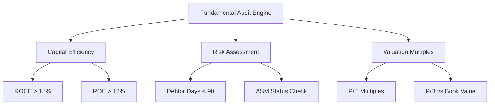

# Trading Indicators & Valuations

This document describes the technical analysis indices, fundamental evaluation metrics, portfolio risk assessments, and decision-making logic models built into the StockSentinel platform.

## 1. Technical Indicators & Scanners

The platform evaluates the following technical indicators on all watchlists and details views:

### 1.1 Relative Strength Index (RSI-14)
The Relative Strength Index measures the speed and change of price movements, tracking momentum over a 14-day window:

$$\text{RSI} = 100 - \left( \frac{100}{1 + \text{RS}} \right)$$

$$\text{RS} = \frac{\text{Average Gain of Up Days}}{\text{Average Loss of Down Days}}$$

* **Classification Zones:**
  - **Oversold ($\le 30$):** Indicates that the asset is heavily sold and may be primed for a bullish trend reversal.
  - **Overbought ($\ge 70$):** Indicates that the asset is extended and could experience a near-term correction or pullback.
  - **Neutral ($31 - 69$):** Normal trading activity zone.

### 1.2 50-Day Simple Moving Average (SMA-50)
Calculates the arithmetic mean of closing prices over the past 50 trading days:

$$\text{SMA-50} = \frac{1}{50} \sum_{i=1}^{50} \text{Price}_{t-i}$$

* **Trend Signals:**
  - **Bullish Breakout (Price > SMA-50):** The stock's current price is trading above its short-term historical average, confirming upward momentum.
  - **Bearish Breakdown (Price < SMA-50):** The stock is trading below its moving average, implying a downward trend.

## 2. Fundamental Valuation Metrics

### 2.1 Capital Efficiency (ROCE & ROE)
* **Return on Capital Employed (ROCE):** Evaluates how efficiently a company employs its total capital (equity + debt) to generate operating profits.
  $$\text{ROCE} = \frac{\text{EBIT}}{\text{Total Assets} - \text{Current Liabilities}} \times 100\%$$
* **Return on Equity (ROE):** Measures the rate of return earned on the shareholders' equity.
  $$\text{ROE} = \frac{\text{Net Income}}{\text{Shareholders' Equity}} \times 100\%$$
* **Growth Benchmarks:** High-quality businesses are identified when both ROCE and ROE sustain values above $15\%$.

### 2.2 Working Capital Health & Debtor Days
* Measures the average number of days it takes for a company to collect cash from its clients after a sale.
* **Warning Threshold:** Debtor days exceeding 180 days indicate potential cash flow problems, where sales are reported on paper but cash is not being collected.

### 2.3 Additional Surveillance Measure (ASM) Listings
* The Securities and Exchange Board of India (SEBI) places stocks on the ASM list to alert investors about high price volatility or speculative trading volumes.
* StockSentinel scans for ASM flags to protect investors from high-risk, speculative positions.

## 3. Investment Action Recommendation Matrix

The rebalancing engine evaluates each portfolio position and generates a recommendation badge:

| Recommendation | Conditions | Actionable Context |
|---|---|---|
| **Trim / Sell** | Position weight $>30\%$ of portfolio OR (P/E $>40$ AND price is within the $>95\%$ percentile of its 52-week range) | Secure gains or reduce concentration risk in overvalued holdings. |
| **Buy / Accumulate**| P/E $<15$ AND ROCE/ROE $>15\%$ OR (Price is within the $<10\%$ percentile of its 52-week range and ROE $>12\%$) | Accumulate high-quality compounding stocks at a discount. |
| **Hold** | All intermediate criteria not matching the boundaries above | Maintain current allocation; fair value range. |

## 4. Portfolio Risk & Optimization Models

### 4.1 Value-at-Risk (VaR 95%)
StockSentinel estimates the maximum expected loss of the user's portfolio over a 1-day horizon at a $95\%$ confidence level:

$$\text{VaR}_{95\%} = 1.65 \times \sigma_{p} \times V_p$$

Where:
* $\sigma_{p}$ is the historical weighted standard deviation of the portfolio's returns.
* $V_p$ is the current total market value of the portfolio.

### 4.2 Sharpe Ratio Optimizer
Compares the expected portfolio return against a risk-free rate of return relative to its risk volatility:

$$\text{Sharpe Ratio} = \frac{\mathbb{E}[R_p] - R_f}{\sigma_p}$$

Where:
* $\mathbb{E}[R_p]$ is the expected return configured via the interactive user slider ($8\% - 25\%$).
* $R_f$ is the default risk-free rate ($5.0\%$, standard for liquid government bonds).
* $\sigma_p$ is the portfolio's historical volatility.

* **Rating Classifications:**
  - **Sharpe $\ge 2.0$:** `Excellent` risk-adjusted return profile.
  - **Sharpe $1.0 - 1.99$:** `Good` balanced profile.
  - **Sharpe $< 1.0$:** `Sub-optimal` efficiency. Recommends reducing high-beta assets.
